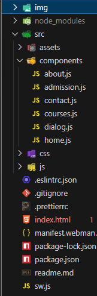
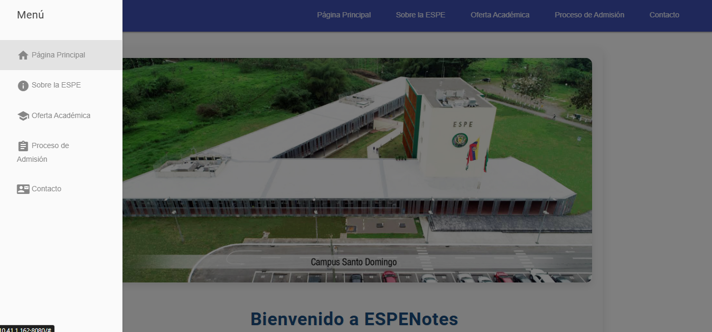
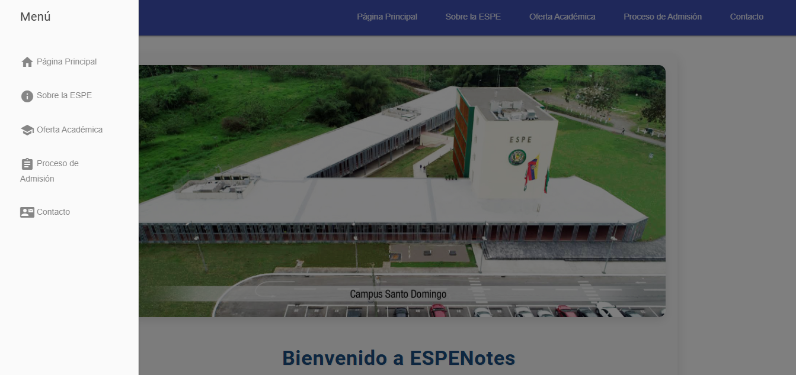
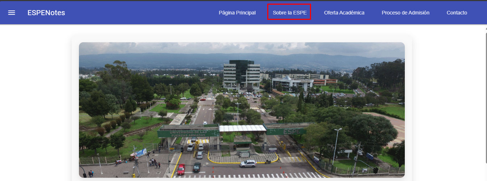
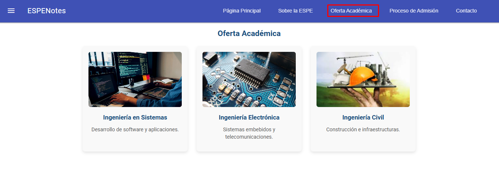
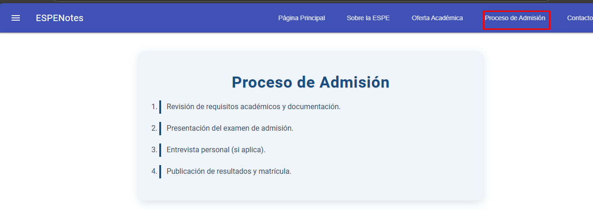
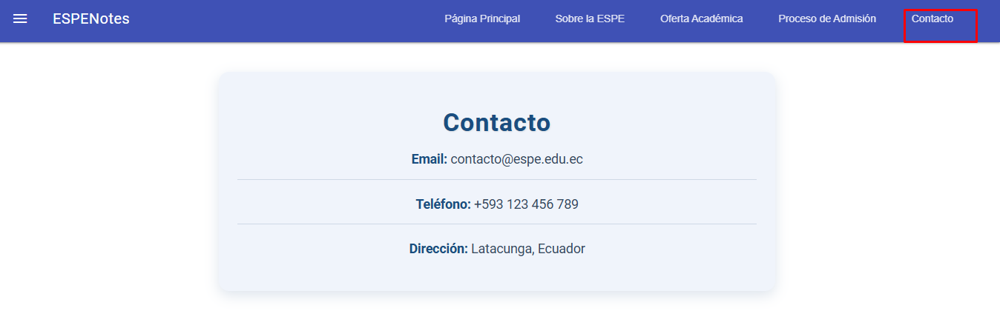

# **Plantilla Base para Progresive Web Apps EXAMEN (PWA) – ESPE**

Este repositorio proporciona una **estructura base optimizada** para el desarrollo de aplicaciones web progresivas (PWA), ideal para proyectos personales, académicos o profesionales. Incluye servidor de desarrollo con recarga automática, herramientas de calidad de código y configuración básica de service worker y manifest.

## **Características**

- Estructura modular de archivos (`src/`, `css/`, `js/`, `assets/`).
- Configuración lista para desarrollo con `live-server`
- Linting con `ESLint` y formateo automático con `Prettier`.
- Scripts de automatización vía `npm`
- Manifest y Service Worker funcionales
- Diseño base con Material Design Lite (MDL)


## **Instalación**

Para instalar y configurar el proyecto en tu máquina local, sigue estos pasos:

### **1. Clona el repositorio**

Si aún no has clonado el repositorio, utiliza el siguiente comando para clonarlo:

```bash
git clone https://github.com/arquimides12/Examen_U3.git 
```
## Link para celular git page 
```bash
Link de page git: https://arquimides12.github.io/Examen_U3/ 
```
En mi caso sucedio esto ya que cree el repositorio despues.

# Instala las dependencias
Entra en el directorio del proyecto y ejecuta el siguiente comando para instalar las dependencias:

```bash
npm install
npm run dev
```

Esto abrirá la aplicación en: 
```bash
 http://127.0.0.1:8080/
``` 
Esto abrirá la app en tu navegador mediante `live-server`, con recarga en tiempo real.

- Para formatear el código automáticamente:

```bash
npm run format
``` 
- Para verificar errores de estilo y sintaxis: 

```bash
npm run lint
``` 
-Para simular entorno de producción:

```bash
npm run serve
``` 
## Uso live-server

live-server permite ver los cambios en tiempo real. A diferencia de http-server, no guarda caché automáticamente y es ideal para desarrollo activo.

Al probar un Service Worker, el navegador puede almacenar en caché versiones antiguas del sitio. Por eso, el script serve utiliza: 

```bash
npx http-server ./src -c-1
``` 
El flag -c-1 desactiva el caché del navegador para asegurar que se pruebe siempre la última versión.

## PWA (Progressive Web App)
- El proyecto incluye manifest.json para configuración de nombre, iconos, tema y modo de presentación.

- Service Worker implementado para cacheo de recursos estáticos y permitir funcionamiento offline básico.

- Uso recomendado bajo HTTPS para funcionalidades completas.




## Reutilización en Nuevos Proyectos

Para usar esta plantilla en futuros proyectos:

- Copia la estructura completa del repositorio.

- Cambia el contenido de index.html, manifest.json y app.js según el nuevo proyecto.

- Mantén package.json y los scripts para seguir utilizando el entorno automatizado.

- Personaliza src/assets/icons/ con íconos propios.

- Actualiza README.md según corresponda.

## Recomendaciones 
-  Usa extensiones como ESLint y Prettier en tu editor (VSCode) para mantener calidad de código en tiempo real.
- Asegúrate de servir tu aplicación desde un entorno HTTPS para probar funcionalidades PWA como serviceWorker o instalación.
- Puedes mejorar la estructura CSS usando un framework más robusto como Tailwind o Bootstrap si el proyecto lo requiere.

## Licencia 

MIT - Puedes usar libremente este código para fines personales, académicos o comerciales.

## Integración de Calidad de Código

- Este entorno incluye:

- ESLint: Encuentra errores y problemas de estilo.

- Prettier: Formatea el código automáticamente.

- Ambos integrados con scripts para ejecutarse fácilmente desde la terminal.


# Ejecucion 



Segunda captura de ejecución 



tercera captura de ejecución 



cuarta captura de ejecución 



quinta captura de ejecución 



sexta captura de ejecución 




